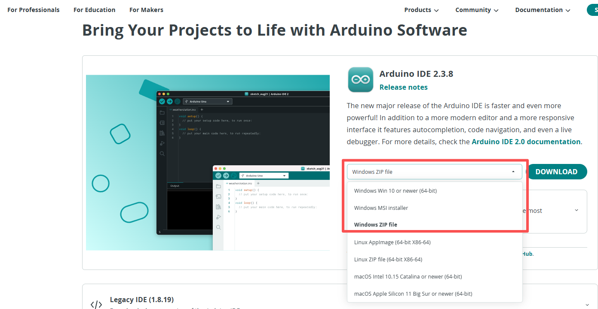
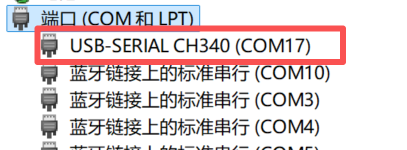
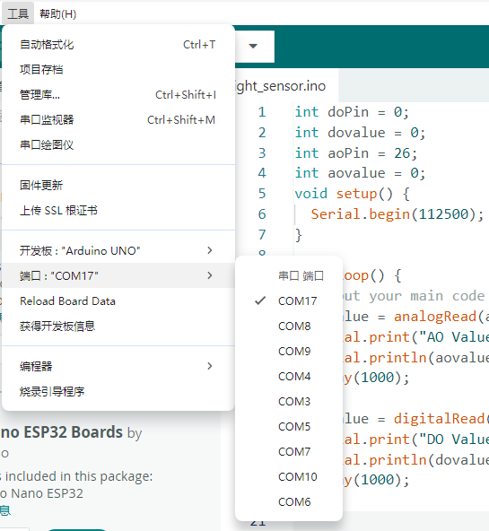
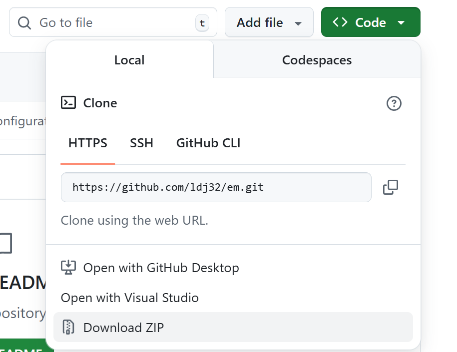
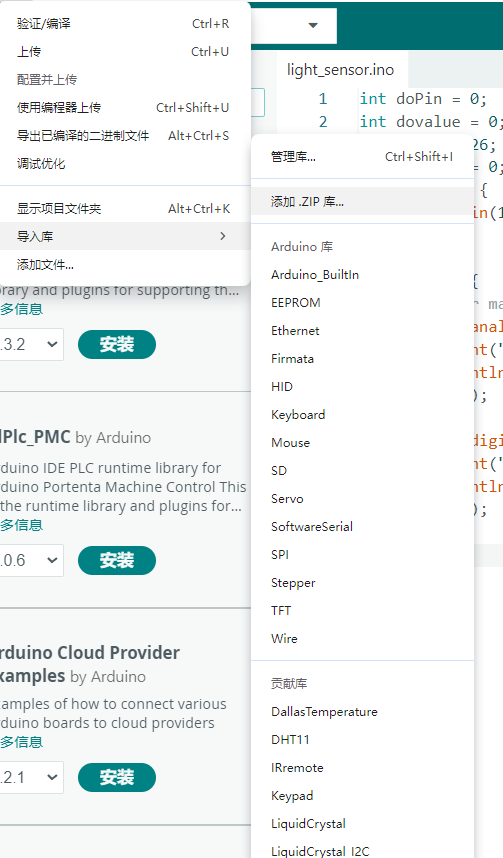
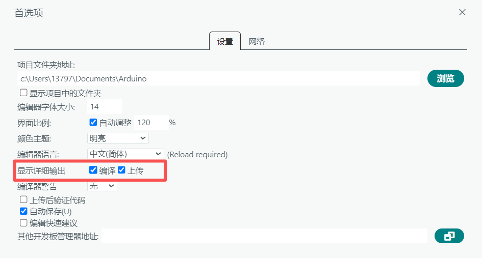
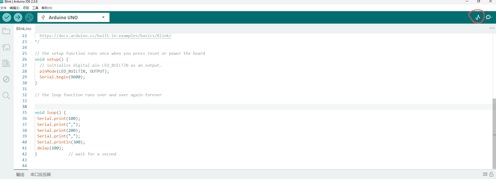
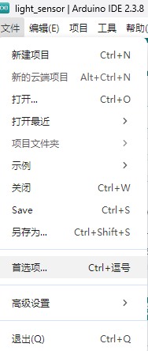
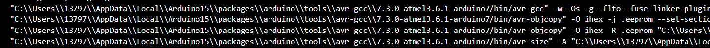
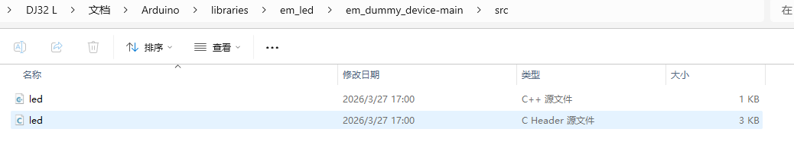

# Arduino IDE 2.0 介绍
# [Arduino IDE 2.0 介绍](https://docs.emakefun.com/#/zh-cn/software/arduino_ide/arduino_ide.zh-CN?id=arduino-ide20%e4%bb%8b%e7%bb%8d)
## [一、软件概述](https://docs.emakefun.com/#/zh-cn/software/arduino_ide/arduino_ide.zh-CN?id=%e4%b8%80%e3%80%81%e8%bd%af%e4%bb%b6%e6%a6%82%e8%bf%b0)
### [1.1 IDE 介绍](https://docs.emakefun.com/#/zh-cn/software/arduino_ide/arduino_ide.zh-CN?id=_11-ide%e4%bb%8b%e7%bb%8d)
Arduino IDE（Integrated Development Environment，集成开发环境）是专为 Arduino 硬件开发设计的软件工具，它简化了编程过程，使得初学者和专业人士都能轻松开发微控制器应用。Arduino IDE 提供了一个易于使用的界面，允许用户使用基于 C/C++ 的简化语言编写、编辑、编译和上传代码到 Arduino 微控制器板。‌建议在 Windows 10 且内存 8G 及以上配置的电脑上使用。

### [1.2 Arduino IDE 2.0 和 1.0 的主要区别](https://docs.emakefun.com/#/zh-cn/software/arduino_ide/arduino_ide.zh-CN?id=_12-arduino-20%e5%92%8c10%e7%9a%84%e5%8c%ba%e5%88%ab)
相比于 2021 年之前发布的 Arduino IDE 1.x 版本，官方于 2022 年正式推出的 Arduino IDE 2.0 版本在重构后引入了多项核心改进，提升了开发效率与体验。

* **集成串口监视器与绘图仪**：允许同时打开 Serial Monitor（串口监视器）与全新的 Serial Plotter（串口绘图仪），可实时查看和绘制串口数据。

* **性能与界面优化**：全面提升了代码编译、上传及串口输出的速率，操作界面响应更迅速、更直观。
* **智能代码补全**：支持基于已输入内容的智能代码提示与自动补全功能，并可检查潜在拼写错误，提高编码效率与准确性。
* **深色主题模式**：提供重新设计、更具一致性与美感的深色主题（黑底白字），有效缓解长时间编程的视觉疲劳。

* **云端项目同步**：无缝集成 Arduino Cloud 及 Arduino Web Editor，支持将项目草图（Sketch）存储在云端，实现在多台设备间的同步与接续开发。

* **强大的串口绘图仪**：新工具 Serial Plotter 能同时绘制多个变量的实时变化曲线，尤其适用于传感器数据校准及动态数据对比分析。

* **自动更新支持**：自动提醒并支持一键更新新增的开发板（Board）与库（Library）支持包，无需手动查找。

\_注\_：Arduino IDE 2.0 基于 **Eclipse Theia** 框架开发（与 Visual Studio Code 同源），前端主要使用 TypeScript，后端主要使用 Go（Golang），采用了类似的 Language Server Protocol 和扩展架构。

### [1.3 Arduino IDE 和市面上其他软件的区别（以 Keil 为例）](https://docs.emakefun.com/#/zh-cn/software/arduino_ide/arduino_ide.zh-CN?id=_13-arduino-ide%e5%92%8c%e5%b8%82%e9%9d%a2%e4%b8%8a%e5%85%b6%e4%bb%96%e8%bd%af%e4%bb%b6%e7%9a%84%e5%8c%ba%e5%88%ab%ef%bc%88keil%e4%b8%ba%e4%be%8b%ef%bc%89)
|对比维度|Arduino IDE|Keil|
| ----- | ----- | ----- |
|**目标用户群**|主要面向初学者和爱好者，适合快速入门和原型开发。|通常用于专业的嵌入式系统开发，适用于需要高级功能和复杂项目的开发者。|
|**支持的硬件**|专注于支持 Arduino 开发板，提供简单的接口和库。|支持广泛的嵌入式开发板和芯片，适用于多种不同类型的嵌入式系统开发。|
|**功能和复杂性**|功能相对简单，适合快速原型设计和简单项目，编程界面易于理解。|功能更丰富和复杂，具有更强大的调试功能、性能优化和硬件支持。|
|**学习曲线**|学习曲线平缓，适合初学者迅速上手。|学习曲线较陡峭，需要更多时间和经验来掌握其功能和特性。|
|**开发生态**|拥有庞大的开源社区和丰富的开源项目资源，便于分享和学习。|作为专业嵌入式开发工具，提供了更为完善的支持和技术资源。|

## [二、Arduino IDE 软件的使用](https://docs.emakefun.com/#/zh-cn/software/arduino_ide/arduino_ide.zh-CN?id=%e4%ba%8c%e3%80%81arduino-ide%e8%bd%af%e4%bb%b6%e7%9a%84%e4%bd%bf%e7%94%a8)
### [2.1 下载 Arduino IDE 软件](https://docs.emakefun.com/#/zh-cn/software/arduino_ide/arduino_ide.zh-CN?id=_21-%e4%b8%8b%e8%bd%bdarduino-ide%e8%bd%af%e4%bb%b6)
##### 2.1.1访问 [Arduino 官网](https://www.arduino.cc/en/software) 下载并安装 Arduino IDE 软件。


##### 2.1.2绿色安装包，下载后只需解压，即可直接使用
同2.1.1一样的操作，但是选择Windows ZIP file，进行下载即可



### [2.2设置中文环境](https://docs.emakefun.com/#/zh-cn/software/arduino_ide/arduino_ide.zh-CN?id=_24-%e5%a6%82%e4%bd%95%e8%87%aa%e5%b7%b1%e7%bc%96%e5%86%99%e8%bd%af%e4%bb%b6%e5%ba%93)
对于初学者而言，语言是一大难题，但在Arduino IDE2.0中，已内置官方中文语言包，你可以直接进行使用，不需要担心兼容性和病毒的问题。（在实际使用过程中，需要注意翻译是否准确）

* 打开 Arduino IDE → 进入首选项

File（文件） → Preferences（首选项）

* 填写语言代码 zh-CN

向下滚动，找到这一项：Editor Language（编辑器语言）

在输入框里输入：zh-CN

\-全小写即可，不要加引号

* 保存并重启 IDE

点击右下角 OK 保存设置，然后完全关闭 Arduino IDE。

再次打开时——恭喜！整个界面已经变成 简体中文 了！

### [2.3 配置开发板](https://docs.emakefun.com/#/zh-cn/software/arduino_ide/arduino_ide.zh-CN?id=_24-%e5%a6%82%e4%bd%95%e8%87%aa%e5%b7%b1%e7%bc%96%e5%86%99%e8%bd%af%e4%bb%b6%e5%ba%93)
  在Arduino IDE中，我们需要对开发板进行配置，才能进行开发，

*   打开开发板管理器，Arduino IDE中：**工具 → 开发板 → 开发板管理器 ** 

*   搜索并安装开发板支持包

   常见开发板搜索关键词：

  Arduino AVR Boards：搜索"avr"，安装"Arduino AVR Boards"

   ESP32：搜索"esp32"，安装"esp32 by Espressif Systems"

   Raspberry Pi Pico ：搜索"pico"，安装"Arduino Mbed OS RP2040 Boards"

*   选择开发板， 安装完成后：**工具 → 开发板 → 选择对应的开发板型号**


### [2.4 如何配置端口（以 Windows 为例）](https://docs.emakefun.com/#/zh-cn/software/arduino_ide/arduino_ide.zh-CN?id=_23-%e5%a6%82%e4%bd%95%e5%ae%89%e8%a3%85%e8%bd%af%e4%bb%b6%e5%ba%93%ef%bc%88windows%e4%b8%ba%e4%be%8b%ef%bc%89)
端口是Arduino开发板与计算机通信的通道：

计算机 ←→ USB连接 ←→ 端口(COM/tty) ←→ Arduino开发板

##### **2.4.1Windows系统配置端口**
 通过设备管理器查找端口

*  打开设备管理器

     - Win + X → 设备管理器

     - 或：控制面板 → 设备管理器

*  展开"端口(COM 和 LPT)"
*  查找USB串口设备：

     ├── USB-SERIAL CH340 (COM3)     ← 常见克隆板

     ├── USB Serial Port (COM4)      ← 官方板

     ├── CP210x USB to UART (COM5)   ← CP2102芯片

     └── Arduino Uno (COM6)          ← 原版Uno

* 记住COM口号，在Arduino IDE中选择



* 
##### **2.4.2Arduino IDE上配置端口**
  找到我们开发板上的端口后，我们重新回到Arduino IDE中，在工具中选择你的端口即可




##### [2.5 如何安装扩展库（以 Windows 为例）](https://docs.emakefun.com/#/zh-cn/software/arduino_ide/arduino_ide.zh-CN?id=_23-%e5%a6%82%e4%bd%95%e5%ae%89%e8%a3%85%e8%bd%af%e4%bb%b6%e5%ba%93%ef%bc%88windows%e4%b8%ba%e4%be%8b%ef%bc%89)
##### **2.5.1使用 Arduino IDE 自带的库管理器下载安装库文件。(在线库)**
* 打开 Arduino IDE 软件，在上方菜单栏点击“工具”。
* 在“工具”菜单中，点击“管理库”，打开“库管理器”。
* 在搜索框中输入库名称，或浏览找到需要的库。
* 在显示的库信息中，点击“安装”按钮。


##### **2.5.2离线库下载**
注：以笔者编写的库举例，有能力的读者可以去[Arduino - Home](https://www.arduino.cc/) 或者[GitHub](https://github.com/) 中寻找你需要的库

* 进入页面 [ldj32/em](https://github.com/ldj32/em)
* 点击code，点击download zip
* 解压并安装
* 将下载的库文件安装进Arduino中



* 
\-可以通过“导入库>添加一个.ZIP库”方式直接将压缩文件加入。

\-也可以将下载的压缩包文件解压，然后将解压出来的名为的文件夹移至 “C:\\用户名\\Documents\\Arduino\\Libraries”\\”里， 并重命名为你想取的名字。

* 验证：重启IDE并测试





## [三、示例程序怎么使用](https://docs.emakefun.com/#/zh-cn/software/arduino_ide/arduino_ide.zh-CN?id=%e4%b8%89%e3%80%81%e7%a4%ba%e4%be%8b%e7%a8%8b%e5%ba%8f%e6%80%8e%e4%b9%88%e4%bd%bf%e7%94%a8)
### [3.1 如何打开编译日志](https://docs.emakefun.com/#/zh-cn/software/arduino_ide/arduino_ide.zh-CN?id=_61-%e5%a6%82%e4%bd%95%e6%89%93%e5%bc%80%e7%bc%96%e8%af%91%e6%97%a5%e5%bf%97)
  在我们正式开发之前，需要打开编译日志，这样当我们程序出现错误，或者端口没接好，我们可以通过查看编译日志去排查我们的错误，具体操作如下：

打开 **文件 → 首选项** ,勾选这俩个选项



这时候再去查看程序，会显示出完整的错误日志，我们只需根据错误日志进行修改即可。

### [3.2 使用示例程序](https://docs.emakefun.com/#/zh-cn/software/arduino_ide/arduino_ide.zh-CN?id=_61-%e5%a6%82%e4%bd%95%e6%89%93%e5%bc%80%e7%bc%96%e8%af%91%e6%97%a5%e5%bf%97)
在Arduino IDE中，为了方便开发者学习，IDE内部集成了很多Arduino的例程，点击文件->示例可打开环境内置示例程序。Arduino自带非常多的例程，包括基础、数字、模拟、通讯、显示等。我们所用的是 Basic(基础例程的) Blink 也就是点灯 ，相当于Arduino的Hello,World。

* “Verify”图标，确认程序是否可编译通过
* 点击上传图标，将代码烧录到你的主板中去


然后你就能观察到开发板上的LED指示灯在以 1 秒为间隔不断地亮、灭。、这个时候，然后只要给开发板正确供电，开发板上的黄指指示灯依然能够以 1 秒为间隔不断地亮、灭。程序已经上载到开发板的内部 Flash 里面，可以脱离开发环境在开发板上实际运行了。

## [四、IDE串口工具怎么使用](https://docs.emakefun.com/#/zh-cn/software/arduino_ide/arduino_ide.zh-CN?id=%e5%9b%9b%e3%80%81ide%e4%b8%b2%e5%8f%a3%e5%b7%a5%e5%85%b7%e6%80%8e%e4%b9%88%e4%bd%bf%e7%94%a8)
### [4.1 串口工具的作用](https://docs.emakefun.com/#/zh-cn/software/arduino_ide/arduino_ide.zh-CN?id=_41-%e5%90%84%e4%b8%aa%e5%8f%82%e6%95%b0%e5%90%ab%e4%b9%89)
在嵌入式世界里，微控制器就像一个沉默的黑箱——它在高速运转，却不会说话。这时候，你需要的是是一双能“看见”程序运行过程和接收数据的眼睛。这双眼睛，就是 Arduino IDE 的串口工具 。

串口工具用于通过串行通信接口（COM口）与外部设备进行数据交互，支持参数配置、数据收发、协议调试等功能。

* 串口监视器是最基础的串口调试工具，用于查看串口接收到的文本数据，并可以发送简单的命令给设备。
* 串口绘图仪用于实时可视化串口数据，将接收到的数值绘制成动态曲线图。

### [4.2 各个参数含义](https://docs.emakefun.com/#/zh-cn/software/arduino_ide/arduino_ide.zh-CN?id=_41-%e5%90%84%e4%b8%aa%e5%8f%82%e6%95%b0%e5%90%ab%e4%b9%89)
* 波特率 (Baud Rate)：波特率表示每秒钟传输的位数。在串行通信中，发送和接收设备之间必须使用相同的波特率。常见的波特率包括9600、115200等。
* 数据位 (Data Bits)：数据位表示每个字节中包含的位数。通常设置为8位，但也可以是5、6、7或9位，具体取决于通信协议。
* 校验位 (Parity)：校验位用于在数据传输过程中检测错误。通常有无、奇校验和偶校验三种选项。 停止位 (Stop Bits)：停止位指示一个字节的结束。通常设置为1位或2位。
* 流控制 (Flow Control)：流控制用于控制数据传输的速率，常见的选项包括无流控制、硬件流控制 (RTS/CTS) 和软件流控制 (XON/XOFF)。

### [4.3 串口监视器](https://docs.emakefun.com/#/zh-cn/software/arduino_ide/arduino_ide.zh-CN?id=_41-%e5%90%84%e4%b8%aa%e5%8f%82%e6%95%b0%e5%90%ab%e4%b9%89)
使用串口监视器，你只需要用USB线将Arduino连接到电脑

然后打开** Arduino IDE → 工具 → 串口监视器**（或者快捷键 `Ctrl+Shift+M` ）


### [4.4 串口绘图仪](https://docs.emakefun.com/#/zh-cn/software/arduino_ide/arduino_ide.zh-CN?id=_42-%e4%b8%b2%e5%8f%a3%e7%bb%98%e5%9b%be%e4%bb%aa)
跟串口监视器一样，将Arduino与电脑连接起来
然后点击IDE菜单 **工具 → 串口绘图仪**。




## [五、Arduino 2.0的秘密](https://docs.emakefun.com/#/zh-cn/software/arduino_ide/arduino_ide.zh-CN?id=%e4%ba%94%e3%80%81arduino-20%e7%9a%84%e7%a7%98%e5%af%86)
想对Arduino IDE2.0进行深度的开发，我们需要对底层的驱动程序深入了解，这是win10系统下 Arduino IDE2.0的默认配置（路径可能会因系统设置而异）

|目录路径|大小|用途|
| ----- | ----- | ----- |
|C:\Users\用户名.arduinoIDE|322K|IDE 配置文件|
|C:\Users\用户名\AppData\Local\arduino|110M|Arduino 数据存储|
|C:\Users\用户名\AppData\Local\Arduino15|1.1G|硬件包、库和工具链|
|C:\Users\用户名\Documents\Arduino|7.3M|用户项目库|

接下来我们逐一进行分析

### [5.1 库文件路径](https://docs.emakefun.com/#/zh-cn/software/arduino_ide/arduino_ide.zh-CN?id=_51-%e4%bf%ae%e6%94%b9%e5%ba%93%e6%96%87%e4%bb%b6%e8%b7%af%e5%be%84)
  默认情况下，ArduinoIDE库文件软件包的位置默认在“C:\\Users\\用户名\\Documents\\Arduino”（路径可能会因系统设置而异）。如果你想对其中的库进行修改，不想将其存放在C盘中，你可以进行下面的操作。

* 点开**文件 → 首选项 **
* 修改项目文件夹地址，选择你想要存放的位置




修改完成后，打开Arduino IDE ，可以看到已经安装的库都可以正常使用了：


### [5.2 Arduino开发板路径](https://docs.emakefun.com/#/zh-cn/software/arduino_ide/arduino_ide.zh-CN?id=_52-arduino%e5%bc%80%e5%8f%91%e6%9d%bf%e8%b7%af%e5%be%84)
  在 Arduino IDE 2.0 中，在线安装的板卡（boards）存储路径会默认配置到 C:\\Users\\你的用户名\\AppData\\Local\\Arduino15\\packages\\（路径可能会因系统设置而异）

或者我们可以通过编译代码，查看Arduino开发板路径，打开路径，就可以找到我们的开发板路径



在 C:\\Users\\用户名\\AppData\\Local\\Arduino15中，我们可以找到配置的开发板，这是其详细目录分析

```Plain Text
├── packages/arduino/
│   ├── hardware/
│   │   ├── avr/1.8.7                    # AVR 开发板支持
│   │   └── mbed_rp2040/4.5.0            # RP2040 开发板支持
│   └── tools/
│       ├── avr-gcc/7.3.0-atmel3.6.1     # AVR 编译器
│       ├── arm-none-eabi-gcc/7-2017q4   # ARM 编译器
│       ├── avrdude/8.0.0                # AVR 上传工具
│       ├── openocd/0.11.0               # 调试工具
│       └── rp2040tools/1.0.6            # Pico 工具链
├── libraries/                  # 内置库
├── builtin/                    # 内置工具
├── library_index.json          # 库索引（52MB）
└── package_index.json          # 包索引（1.4MB）
```


### [5.3 编译生成的文件路径](https://docs.emakefun.com/#/zh-cn/software/arduino_ide/arduino_ide.zh-CN?id=_53-%e7%bc%96%e8%af%91%e7%94%9f%e6%88%90%e7%9a%84%e6%96%87%e4%bb%b6%e8%b7%af%e5%be%84)
  Arduino IDE（集成开发环境）生成HEX文件通常是在完成程序编写并上传到Arduino硬件的过程中发生的。默认路径配置在C:\\Users\\13797\\AppData\\Local\\arduino\\sketches（路径可能会因系统设置而异）中，以下是其编译输出目录结构

```Plain Text
C:\Users\13797\AppData\Local\arduino\sketches\随机ID

├── Blink/                      # 你的工程名称
│   ├── Blink.ino               # 源文件
│   ├── core/                   # Arduino 核心库
│   │   ├── core.a
│   │   └── ...
│   ├── includes/               # 头文件缓存
│   │   └── cache/
│   ├── libraries/              # 使用的库
│   │   └── ...
│   ├── sketch/                 # 编译后的 .o 文件
│   │   ├── Blink.ino.o
│   │   └── ...
│   ├── dependencies/           # 依赖关系文件
│   │   └── Blink.ino.d
│   ├── prerequisites/          # 前置条件
│   │   └── ...
│   ├── build.options.json      # 编译选项
│   └── firmware/               # 🔥 最终输出
│       ├── Blink.ino.hex       # 主要输出文件
│       ├── Blink.ino.hex       # 带启动引导的hex
│       ├── Blink.ino.elf       # ELF格式（调试用）
│       ├── Blink.ino.bin       # 二进制格式
│       └── Blink.ino.with_bootloader.hex
```
如果不知道自己的临时文件存储地址，我们可以通过 Arduino IDE 详细输出查看

*    编译你的工程（比如 Blink）
*   在输出控制台滚动到最底部，会看到类似：


*   复制路径，在资源管理器中粘贴即可访问

### 
## [六、常见错误排查](https://docs.emakefun.com/#/zh-cn/software/arduino_ide/arduino_ide.zh-CN?id=%e5%85%ad%e3%80%81%e5%b8%b8%e8%a7%81%e9%94%99%e8%af%af)
### [6.1 如何通过编译错误定位解决问题](https://docs.emakefun.com/#/zh-cn/software/arduino_ide/arduino_ide.zh-CN?id=_62-%e5%a6%82%e4%bd%95%e9%80%9a%e8%bf%87%e7%bc%96%e8%af%91%e9%94%99%e8%af%af%e5%ae%9a%e4%bd%8d%e8%a7%a3%e5%86%b3%e9%97%ae%e9%a2%98)
在使用Arduino开发板和Arduino IDE进行项目开发时，用户可能会遇到各种错误，这些错误可能源于硬件连接、软件配置或代码编写等方面的问题，以下是一些常见的Arduino报错及其解决方法：

|**错误类型**|**错误描述**|**可能原因**|**解决方法**|
| ----- | ----- | ----- | ----- |
|Board not in Sync|计算机无法与Arduino板建立通信|1\. 电路板类型不匹配 2. 上传代码时未按下复位按钮 3. 串口管脚0、1被占用 4. 串口不匹配|1\. 检查并确保电路板类型与使用的一致 2. 在上传代码时按下电路板上的复位按钮 3. 断开串口管脚0、1中的一个连接线 4. 断开电路板，查看哪个端口从列表中消失，然后重新连接开发板并选择相应端口|
|COM端口错误|选择的串行端口与连接的Arduino板不正确|1\. USB数据线或开发板本身[存在](https://blog.huochengrm.cn/zmt/15089.html)问题 2. 多个设备连接到计算机 3. 驱动程序损坏或需要更新|1\. 断开并重新连接Arduino板 2. 检查设备管理器以查看Arduino板是否在端口部分下 3. 尝试不同的USB数据线或USB端口 4. 重新启动计算机和Arduino IDE|
|无法识别Arduino板|Arduino板没有被电脑识别|1\. USB电缆连接不牢固 2. USB数据线或开发板本身有问题 3. 驱动损坏或需要更新|1\. 验证USB电缆连接是否牢固 2. 检查设备管理器以查看Arduino板是否在端口部分下 3. 检查并更新驱动|
|串口正在使用中|尝试使用的端口当前正在被另一个应用程序或进程使用|1\. 其他应用程序正在使用串行端口 2. USB电缆连接问题|1\. 关闭可能正在使用串行端口的其他应用程序 2. 尝试从Arduino板上断开USB电缆，然后重新连接以释放串口 3. 使用不同的串行端口|
|串行监视器不工作|串行监视器无法显示数据或乱码|1\. 连接错误 2. 代码编写错误 3. 波特率设置不正确 4. 缓冲区数据过多|1\. 检查连接是否正确 2. 确保代码包含必要的Serial.begin()和Serial.print()语句 3. 调整串行监视器中的波特率设置 4. 按“清除”按钮清除缓冲区 5. 重置Arduino|
|编译错误|代码无法成功编译|1\. 语法错误 2. 缺失符号或分号 3. 拼写错误 4. 缺失变量定义 5. 程序中多余的文本|1\. 根据错误提示信息定位到出错位置并进行修正 2. 确保所有符号和分号正确无误 3. 检查拼写是否正确 4. 确保所有变量都已声明 5. 删除多余的文本|
|上传错误|代码无法成功上传至Arduino板|1\. 硬件连接故障 2. 选择了错误的开发板或端口 3. 草图[尺寸](https://blog.huochengrm.cn/ask/15210.html)大于电路板容量 4. 引导加载程序损坏|1\. 检查硬件连接是否正确 2. 确保选择了正确的开发板和端口 3. 减少代码占用空间或分割代码 4. 使用外部编程器上传草图或刷新引导加载程序|

### [6.2 开发板故障排查](https://docs.emakefun.com/#/zh-cn/software/arduino_ide/arduino_ide.zh-CN?id=_54-%e5%bc%80%e5%8f%91%e6%9d%bf%e6%95%85%e9%9a%9c%e6%8e%92%e6%9f%a5)
要验证Arduino是软件问题、硬件问题还是驱动问题，可以按照以下步骤进行排查：

* **检查硬件连接**
物理连接：确保Arduino板正确连接到计算机，并且连接线没有损坏。检查USB端口是否工作正常，可以尝试连接其他设备到同一个端口。
电源指示灯：检查Arduino板上的电源指示灯是否亮起，确认电源供应是否正常。

* **检查驱动程序**
设备管理器：在计算机的设备管理器中查看是否有未知设备或有问题的设备。如果有，尝试更新或重新安装驱动程序。
驱动安装：参考Arduino IDE安装及驱动教程，确保已经安装了正确的驱动程序。对于Windows系统，可能需要手动安装驱动。
端口识别：在Arduino IDE中检查是否能够识别到串行端口。如果IDE无法识别串行端口，可能是驱动问题。

* **测试Arduino IDE**
IDE版本：确保使用的是最新版本的Arduino IDE，老版本的IDE可能存在兼容性问题。
板和端口选择：在IDE中选择正确的板型和端口。如果选择错误，IDE可能无法与Arduino板通信。

* **测试简单的程序**
基础程序：上传一个简单的程序（如Blink）到Arduino板上，检查LED是否闪烁。如果基础程序无法工作，可能是硬件问题。
串行通信：使用串行监视器测试串行通信是否正常。如果无法接收到数据，可能是硬件或驱动问题。

* **检查硬件**
替换测试：如果可能，尝试将Arduino板替换到另一台计算机上，或者使用另一块Arduino板替换当前的板，以排除是特定硬件的问题。
组件检查：检查Arduino板上是否有可见的损坏，如烧毁的组件或焊接问题。

* **软件问题排查**
编译错误：查看IDE中的编译错误信息，这可以提供关于代码问题的线索。
库依赖：确保所有必需的库都已经安装，并且代码中没有引用不存在的库或函数。

## [七、编写属于自己的扩展库](https://docs.emakefun.com/#/zh-cn/software/arduino_ide/arduino_ide.zh-CN?id=%e5%85%ad%e3%80%81%e5%b8%b8%e8%a7%81%e9%94%99%e8%af%af)
在开发过程中，为了满足自己或者项目的独特需求，我们需要掌握编写扩展库的能力

* 功能独特：现有库无法满足需求
* 代码复用：避免重复劳动
* 组织代码：让代码更清晰、易维护
* 封装复杂：隐藏实现细节，简化使用
* 模块化：便于测试和协作
* 保护知识产权：商业应用需要
* 社区贡献：分享知识，帮助他人

### [7.1 编写源文件头文件](https://docs.emakefun.com/#/zh-cn/software/arduino_ide/arduino_ide.zh-CN?id=_62-%e5%a6%82%e4%bd%95%e9%80%9a%e8%bf%87%e7%bc%96%e8%af%91%e9%94%99%e8%af%af%e5%ae%9a%e4%bd%8d%e8%a7%a3%e5%86%b3%e9%97%ae%e9%a2%98)
在 C/C++ 开发中，一个代码模块通常由以下核心文件组成：

|文件|作用|
| ----- | ----- |
|**.h (Header)**|头文件，包含类声明、函数原型等。|
|**.cpp (Source)**|源文件，包含函数的具体实现。|

Arduino IDE 继承了 C/C++ 风格，因此封装功能模块通常需要成对的“.h”和“.cpp”（或“.c”）文件。例如，若要将 LED 控制封装成模块，可以创建 `led.h` 和 `led.cpp` 两个文件。

**示例代码文件**

```Plain Text
/**
 *led.cpp
 */

#include "Arduino.h"
#include "led.h"

LED::LED(byte p, bool state) : pin(p)
{

    pinMode(pin, OUTPUT);
    digitalWrite(pin, state);
}

LED::~LED()
{
    detach();
}

void LED::on()
{
    digitalWrite(pin, HIGH);
}

void LED::off()
{
    digitalWrite(pin, LOW);
}

bool LED::getState()
{
    return digitalRead(pin);
}

void LED::detach() 
{
    digitalWrite(pin, LOW);
    pinMode(pin, INPUT);
}
```
以上示例存放在[em/em\_dummy\_device-main at master · ldj32/em](https://github.com/ldj32/em/tree/master/em_dummy_device-main) 受限于篇幅原因，不展示`led.h`的源代码，其中src存放着`led.h`

和`led.cpp` 的源代码， examples中存放着`blink.ino` ，可以通过调用它实现点亮主板上自带的led灯的效果。

### [7.2 在Arduino上使用自己的库](https://docs.emakefun.com/#/zh-cn/software/arduino_ide/arduino_ide.zh-CN?id=_62-%e5%a6%82%e4%bd%95%e9%80%9a%e8%bf%87%e7%bc%96%e8%af%91%e9%94%99%e8%af%af%e5%ae%9a%e4%bd%8d%e8%a7%a3%e5%86%b3%e9%97%ae%e9%a2%98)
  如果模块好用且经常使用，可将它变成自己的库文件，以便于将来的项目直接调用。

#####  7.2.1库的标准文件结构
  MyLibrary/                    # 库文件夹（库名）

  ├── MyLibrary.h               # 头文件（声明）

  ├── MyLibrary.cpp             # 源文件（实现）

  ├── keywords.txt              # 可选：语法高亮

  ├── library.properties        # 可选：库元数据

  ├── examples/                 # 可选：示例代码

  │   └── BasicExample/

  │       └── BasicExample.ino

  └── README.md                 # 可选：说明文档

#####  7.2.2使用自己的库的步骤
*  创建库文件（.h 和 .cpp）
*  放到正确位置(“C:\\用户名\\Documents\\Arduino\\Libraries”\\”）
*  重启Arduino IDE
*  在.ino中引用（#include < led.h>）
*  创建对象并使用



